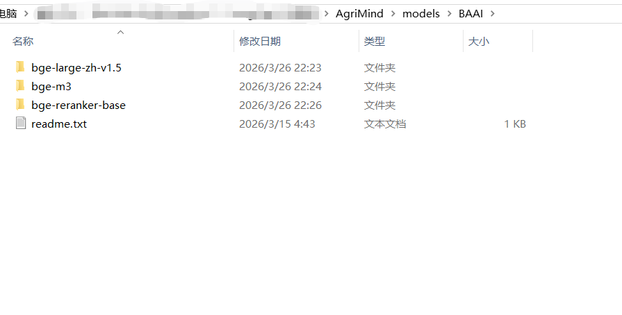

# 🌾 智能农业助手 - LangChain 1.0 多智能体协同实战案例

> **给小白的第一份 LangChain 1.0 完整教程**  
> 从零开始构建带记忆机制、RAG检索、流式输出的多智能体系统

[](https://python.org)
[](https://langchain.com)
[](https://langchain-ai.github.io/langgraph/)

## 📖 项目简介

这是一个基于 **LangChain 1.0 + LangGraph** 构建的智能农业问答系统，专为初学者设计。项目展示了如何构建一个完整的生产级多智能体系统，包含以下核心特性：

- 🤖 **多智能体协同**：意图分类器 + 农事专家Agent + 普通对话Agent
- 🧠 **智能记忆系统**：自动提取实体画像、生成对话摘要、支持长期记忆
- 🔍 **RAG检索增强**：向量检索 + BM25 + 重排序的混合检索策略
- ⚡ **流式输出**：完整的流式响应，提升用户体验
- 💾 **多级缓存**：向量检索结果缓存、对话记忆持久化

### 为什么适合小白？

| 特性 | 说明 |
|------|------|
| **代码注释详细** | 关键逻辑都有中文注释，解释"为什么这么做" |
| **模块化设计** | 每个文件职责单一，易于理解和替换 |
| **渐进式学习** | 从简单到复杂，可以只跑部分功能 |
| **生产级实践** | 包含配置管理、日志、错误处理等真实场景必备内容 |

---

## 🏗️ 系统架构

```
================================================================================
                         🌾 智能农业助手 - 系统架构图
================================================================================

┌─────────────────────────────────────────────────────────────────────────────┐
│                              【用户接入层】                                   │
│  ┌─────────────┐      ┌─────────────┐      ┌─────────────┐                  │
│  │  Streamlit  │      │   FastAPI   │      │   命令行    │                  │
│  │   Web界面   │      │   API服务   │      │   测试脚本  │                  │
│  │  (Port 8501)│      │  (Port 8000)│      │             │                  │
│  └──────┬──────┘      └──────┬──────┘      └──────┬──────┘                  │
└─────────┼─────────────────────┼─────────────────────┼────────────────────────┘
          │                     │                     │
          └─────────────────────┴─────────────────────┘
                                │
                                ▼
┌─────────────────────────────────────────────────────────────────────────────┐
│                         【应用服务层】App Layer                                │
│                                                                              │
│   ┌─────────────────────────────────────────────────────────────────────┐   │
│   │                    AgentSystemStreaming (智能体总控)                 │   │
│   │  ┌─────────────────────────────────────────────────────────────┐   │   │
│   │  │                    LangGraph 状态机                          │   │   │
│   │  │                                                              │   │   │
│   │  │   START ──▶ load_memory ──▶ classify ──▶ [路由决策] ──▶ END  │   │   │
│   │  │                              │                              │   │   │
│   │  │                    ┌─────────┴─────────┐                    │   │   │
│   │  │                    ▼                   ▼                    │   │   │
│   │  │           ┌──────────────┐    ┌──────────────┐             │   │   │
│   │  │           │  agronomist  │    │   ordinary   │             │   │   │
│   │  │           │   (农事专家)  │    │   (普通对话)  │             │   │   │
│   │  │           └──────┬───────┘    └──────┬───────┘             │   │   │
│   │  │                  │                  │                     │   │   │
│   │  │                  └────────┬─────────┘                     │   │   │
│   │  │                             ▼                               │   │   │
│   │  │                      save_memory                            │   │   │
│   │  │                                                              │   │   │
│   │  └─────────────────────────────────────────────────────────────┘   │   │
│   └─────────────────────────────────────────────────────────────────────┘   │
│                                                                              │
│   【关键状态流转】                                                            │
│   AgentState = {                                                            │
│       user_id: str,          # 用户标识                                     │
│       query: str,             # 当前问题                                     │
│       intent: Intent,         # 识别意图 (agronomist/ordinary)              │
│       confidence: float,      # 置信度                                       │
│       classify_info: StructOutput,  # 结构化解析结果                         │
│       prepared_messages: List[BaseMessage],  # 历史上下文                    │
│       response: str,          # 最终响应                                     │
│       streaming_callback: Callable   # 流式输出回调                        │
│   }                                                                          │
│                                                                              │
└─────────────────────────────────────────────────────────────────────────────┘
                                │
          ┌─────────────────────┼─────────────────────┐
          ▼                     ▼                     ▼
┌─────────────────┐    ┌─────────────────┐    ┌─────────────────┐
│  【智能体层】    │    │  【记忆管理层】  │    │  【检索引擎层】  │
│   Agents        │    │    Memory       │    │      RAG        │
│                 │    │                 │    │                 │
│ ┌─────────────┐ │    │ ┌─────────────┐ │    │ ┌─────────────┐ │
│ │IntentClassifier│   │ │MemoryManager│ │    │ │RAGProcessor │ │
│ │  (意图识别)  │ │    │ │  (记忆总控)  │ │    │ │ (检索总控)   │ │
│ └─────────────┘ │    │ └──────┬──────┘ │    │ └──────┬──────┘ │
│                 │    │        │        │    │        │        │
│ ┌─────────────┐ │    │ ┌──────┴──────┐ │    │ ┌──────┴──────┐ │
│ │AgronomistAgent│◄────┼─┤ 摘要生成    │ │    │ │ 向量检索    │ │
│ │  (农事专家)  │ │    │ │ 实体提取    │ │    │ │  (FAISS/    │ │
│ └─────────────┘ │    │ │ 画像构建    │ │    │ │ Chroma/     │ │
│                 │    │ └─────────────┘ │    │ │ Milvus)     │ │
│ ┌─────────────┐ │    │                 │    │ └─────────────┘ │
│ │OrdinaryAgent│ │    │ ┌─────────────┐ │    │                 │
│ │  (普通对话)  │ │    │ │ MemoryStore │ │    │ ┌─────────────┐ │
│ └─────────────┘ │    │ │ (存储实现)   │ │    │ │ BM25检索    │ │
│                 │    │ │ ├─SQLite    │ │    │ └─────────────┘ │
│ 【输出方式】     │    │ │ └─SQL Server│ │    │                 │
│ • 流式输出      │    │ └─────────────┘ │    │ ┌─────────────┐ │
│ • 结构化JSON   │    │                 │    │ │RerankerManager│
│                │    │ 【记忆类型】     │    │ │ (重排序)     │
│                │    │ • 短期记忆(5轮) │    │ └─────────────┘ │
│                │    │ • 摘要记忆(LLM) │    │                 │
│                │    │ • 实体画像      │    │ ┌─────────────┐ │
│                │    │                 │    │ │CacheManager │ │
│                │    │                 │    │ │ (结果缓存)   │ │
│                │    │                 │    │ └─────────────┘ │
└─────────────────┘    └─────────────────┘    └─────────────────┘
          │                     │                     │
          └─────────────────────┴─────────────────────┘
                                │
                                ▼
┌─────────────────────────────────────────────────────────────────────────────┐
│                              【基础设施层】                                   │
│                                                                              │
│  ┌─────────────┐  ┌─────────────┐  ┌─────────────┐  ┌─────────────┐        │
│  │   LLM服务   │  │  向量模型    │  │  重排序模型  │  │  配置管理    │        │
│  │ (DeepSeek/ │  │ (BGE-Large/ │  │ (BGE-Rerank)│  │ (RAGConfig/ │        │
│  │  OpenAI等) │  │  BGE-M3)    │  │             │  │ MemoryConfig│        │
│  └─────────────┘  └─────────────┘  └─────────────┘  └─────────────┘        │
│                                                                              │
│  ┌─────────────┐  ┌─────────────┐  ┌─────────────┐  ┌─────────────┐        │
│  │  文档处理   │  │  OCR识别    │  │  日志系统    │  │  数据评估    │        │
│  │ (PDF/Word/ │  │ (Paddle/    │  │ (TimedRotating│  │ (RAGAS)     │        │
│  │ Excel/PPT) │  │ Tesseract) │  │ FileHandler) │  │             │        │
│  └─────────────┘  └─────────────┘  └─────────────┘  └─────────────┘        │
│                                                                              │
└─────────────────────────────────────────────────────────────────────────────┘

================================================================================
```
### 单次对话详细数据流
```python
用户提问
│
▼
┌─────────────────────────────────────┐
│ 1. AgentSystemStreaming 接收请求    │
│    - 创建 AgentState               │
│    - 注册流式回调函数               │
└─────────────────────────────────────┘
│
▼
┌─────────────────────────────────────┐
│ 2. load_memory 节点                  │
│    MemoryManager.load_memory_context()│
│    ├──▶ MemoryStore.get_recent_dialogues()  [获取最近5轮]
│    ├──▶ MemoryStore.get_latest_summary()    [获取历史摘要]
│    ├──▶ MemoryStore.get_entities()          [获取用户画像]
│    └──▶ build_context_messages()           [组装成消息列表]
│         └──▶ 写入 AgentState.prepared_messages
└─────────────────────────────────────┘
│
▼
┌─────────────────────────────────────┐
│ 3. classify 节点                     │
│    IntentClassifier.classify()      │
│    ├──▶ LLM.with_structured_output(StructOutput)
│    │        └──▶ 解析意图 + 置信度 + 原因
│    └──▶ 写入 AgentState.intent/confidence/classify_info
└─────────────────────────────────────┘
│
▼
┌─────────────────────────────────────┐
│ 4. [路由决策] 条件边                  │
│    route_to_agent(state)            │
│    ├──▶ intent == "agronomist" ──▶ AgronomistAgent
│    └──▶ intent == "ordinary"   ──▶ OrdinaryAgent
└─────────────────────────────────────┘
│
├─────────────────────┬─────────────────────┐
▼                     ▼                     │
┌─────────────────┐ ┌─────────────────┐       │
│ AgronomistAgent │ │ OrdinaryAgent   │       │
│ (农事问题)       │ │ (普通问题)       │       │
│                 │ │                 │       │
│ ├─▶ RAGProcessor│ │ ├─▶ 直接使用LLM  │       │
│ │   .aensemble │ │ │   流式回答     │       │
│ │   search_with │ │ │               │       │
│ │   _rerank()   │ │ │               │       │
│ │       │       │ │ │               │       │
│ │       ▼       │ │ │               │       │
│ │   ┌─────────┐ │ │ │               │       │
│ │   │向量检索 │ │ │ │               │       │
│ │   │(FAISS/  │ │ │ │               │       │
│ │   │Milvus)  │ │ │ │               │       │
│ │   └────┬────┘ │ │ │               │       │
│ │        │      │ │ │               │       │
│ │   ┌────▼────┐ │ │ │               │       │
│ │   │BM25检索 │ │ │ │               │       │
│ │   └────┬────┘ │ │ │               │       │
│ │        │      │ │ │               │       │
│ │   ┌────▼────┐ │ │ │               │       │
│ │   │结果合并 │ │ │ │               │       │
│ │   └────┬────┘ │ │ │               │       │
│ │        │      │ │ │               │       │
│ │   ┌────▼────┐ │ │ │               │       │
│ │   │重排序   │ │ │ │               │       │
│ │   │(BGE-   │ │ │ │               │       │
│ │   │Reranker)│ │ │ │               │       │
│ │   └────┬────┘ │ │ │               │       │
│ │        │      │ │ │               │       │
│ │   ┌────▼────┐ │ │ │               │       │
│ │   │组装Prompt│ │ │ │               │       │
│ │   │+知识上下文│ │ │ │               │       │
│ │   └────┬────┘ │ │ │               │       │
│ │        │      │ │ │               │       │
│ └────────┼──────┘ │ │               │       │
│          │        │ │               │       │
│   ┌──────▼────────┴──▼──────┐       │       │
│   │  LLM.astream() 流式生成  │◄──────┘       │
│   │  (实时返回token)         │               │
│   └──────────┬───────────────┘               │
│              │                               │
│   ┌──────────▼──────────┐                   │
│   │ 写入 AgentState.    │◄──────────────────┘
│   │ response            │
│   └─────────────────────┘
│              │
└──────────────┼───────────────────────────────┘
│
▼
┌─────────────────────────────────────┐
│ 5. save_memory 节点                  │
│    MemoryManager.save_dialogue()    │
│    ├──▶ MemoryStore.save_dialogue()  [保存对话]
│    ├──▶ _extract_and_save_entities()[后台提取实体]
│    └──▶ _check_and_update_summary()  [检查并更新摘要]
└─────────────────────────────────────┘
│
▼
┌─────────────────────────────────────┐
│ 6. END 节点                          │
│    返回 AgentState (包含完整响应)   │
└─────────────────────────────────────┘
│
▼
用户看到回复
```

### 核心调用链

1. **用户输入** → `AgentSystemStreaming.ahandle_message_with_streaming_callback()`
2. **加载记忆** → `MemoryManager.load_memory_context()` (获取历史摘要+最近对话+用户画像)
3. **意图识别** → `IntentClassifier.classify()` (结构化输出：意图+置信度+原因)
4. **智能路由** → 根据意图分发到对应Agent
5. **执行处理** → 
   - 农事问题：RAG检索 → 重排序 → 流式生成
   - 普通问题：直接流式生成
6. **保存记忆** → `MemoryManager.save_dialogue()` (提取实体+更新摘要)

---

## 📂 项目结构

```python
├── agent/                          # 多智能体核心层
│   ├── AgentSystemStreaming.py    # 智能体系统总控（LangGraph工作流）
│   ├── IntentClassifierAgent.py   # 意图分类器（结构化输出）
│   ├── AgronomistAgentStreaming.py # 农事专家Agent（带RAG）
│   ├── OrdinaryAgentStreaming.py  # 普通对话Agent
│   ├── Structer.py                # Pydantic模型定义
│   └── Context
│       ├── MemoryManager.py           # 记忆管理器（摘要+实体提取）
│       └── MemoryStore.py             # 记忆存储层（SQLite/SQL Server）
│
├── utils/RAG/                      # RAG检索层
│   ├── RAGConfig.py               # 配置管理（向量库、模型等）
│   ├── RAGProcessor.py            # 检索主入口（混合检索+重排序）
│   ├── RAGSaver.py                # 向量库构建工具
│   ├── VectorStoreFactory.py      # 向量存储工厂（FAISS/Chroma/Milvus）
│   ├── CacheManager.py            # 检索结果缓存（SQLite）
│   ├── RerankerManager.py         # 重排序模型管理
│   ├── MetadataExtractor.py       # 元数据提取（LLM生成过滤条件）
│   └── DocumentChunk
│       ├── PDFImage.py            # pdf图片提取 
│       ├── PyOCR.py               # 图片文字提取
│       ├── WordImage.py           # word图片提取
│       └── DocumentProcessor.py       # 文档处理（PDF/Word/Excel等）
│
├── utils/RAG_Evaluation/                
│   └── RAGAS_Evaluator.py         # RAG评估
│
├── utils/loggers/                     
│   └── logger.py                   # 日志
│
├── prompts/                        # 提示词模板（需自建）
│   └── __init__.py                # 存放 agronomist_prompt 等
│
├── Document/                       # 知识库文档目录
│   └── DocumentTag.json           # 文档标签配置
│
├── StreamlitUI.py                 # Web界面入口
├── fastapi_app.py                 # API服务入口
├── _Streaming_test.py             # 命令行测试入口
├── _RAG_TEST.py                   # 向量库构建测试
├── config.py                      # 全局配置（日志等）
└── .env                           # 环境变量（API密钥等）
```

---

## 🚀 快速开始

### 1. 环境准备

```bash
# 克隆项目
git clone https://github.com/lizhigen-max/AgriMind.git
cd AgriMind
```

```bash
# 创建虚拟环境
python -m venv venv
source venv/bin/activate  # Windows: venv\Scripts\activate
```

```bash
# 安装依赖
pip install -r requirements.txt
```

### 2. 准备reranker模型和embeddings模型
<div align="center">
  
</div>

### 3. 配置环境变量
创建 .env 文件（将.env.example文件改为.env）：
```bash
# LLM配置（DeepSeek示例，可替换为OpenAI等）
DEEPSEEK_NAME=deepseek:deepseek-chat
DEEPSEEK_API_KEY=your_api_key_here

# 向量模型配置
BGE_LARGE_ZH_MODEL_PATH=BAAI/bge-large-zh-v1.5
DEVICE=cpu
NOR_EBDINGS=true

# 向量数据库配置（三选一：faiss/chroma/milvus）
VECTORDBTYPE=milvus
MILVUS_HOST=localhost
MILVUS_PORT=19530
MILVUS_COLLECTION_NAME=rag_collection

# 缓存配置
ENABLED_RAG_CACHE=true
RAG_CACHE_DB_PATH=./data/cache.db
RAG_CACHE_EXPIRE_DAYS=7

# 重排序配置
RERANKER_ENABLED=true
RERANKER_MODEL_PATH=BAAI/bge-reranker-large
RERANKER_THRESHOLD=0.5

# 日志配置
LOG_LEVEL=INFO
LOG_PATH=./logs/app.log
```

### 4. 准备知识库
将你的农业文档放入 ``` Document/ ``` 目录，支持格式：<br>
📄 PDF、Word（.doc/.docx）<br>
📊 Excel（.xls/.xlsx）、CSV<br>
📽️ PowerPoint（.ppt/.pptx）<br>
📝 Markdown、TXT<br>
可选：创建 ```Document/DocumentTag.json``` 为文档打标签：
```json
[
    {"file_name": "葡萄种植手册.pdf", "department": "技术部", "year": 2024},
    {"file_name": "病虫害防治指南.docx", "crop": "葡萄", "type": "技术文档"}
]
```
### 5. 构建向量库
```bash
python _RAG_TEST.py
```
这会读取 Document/ 目录，分块处理后存入向量数据库。
### 6. 运行应用
方式一：Web界面（推荐新手）
```bash
streamlit run StreamlitUI.py
```
访问 http://localhost:8501

方式二：API服务
```bash
python fastapi_app.py
```
访问 http://localhost:8000/docs 查看API文档

方式三：命令行测试
```bash
python _Streaming_test.py
```

## 🎯 核心功能详解
### 1. 意图分类系统
```python
# agent/IntentClassifierAgent.py
class IntentClassifier:
    """使用结构化输出进行意图识别"""
    
    async def classify(self, question: str) -> StructOutput:
        # 输出示例：
        # {
        #   "intent": "agronomist",
        #   "confidence": 0.95,
        #   "reason": "用户询问葡萄修剪，属于农事操作",
        #   "crop": "葡萄",
        #   "behavior": "冬季修剪",
        #   "address": "温宿",
        #   "query_strengthen": "葡萄冬季修剪技术要点"
        # }
```
#### 支持的意图类型：
```agronomist``` - 农事相关问题（作物管理、病虫害等）<br>
```ordinary``` - 普通对话（天气、旅游、闲聊等）
### 2. 记忆系统
记忆系统采用**三级架构**：

| 层级       | 存储内容         | 实现方式             | 用途      |
| -------- | ------------ |------------------| ------- |
| **短期记忆** | 最近5轮对话       | SQLite/SQLServer | 保持对话连贯性 |
| **摘要记忆** | 对话摘要+关键信息点   | LLM生成+SQLite/SQLServer     | 长期上下文理解 |
| **实体画像** | 用户属性、偏好、重要事实 | 结构化提取+SQLit/SQLServere     | 个性化服务   |

记忆工作流程：
```python
# agent/MemoryManager.py 核心逻辑

async def load_memory_context(self, user_id: str) -> MemoryContext:
    # 1. 获取最近N轮对话
    recent = await self.store.get_recent_dialogues(user_id, limit=5)
    
    # 2. 获取历史摘要（如果对话数>阈值，生成新摘要）
    summary = await self.store.get_latest_summary(user_id)
    
    # 3. 获取用户实体画像
    entities = await self.store.get_entities(user_id)
    
    # 4. 组装成LangChain消息格式
    return self._build_context_messages(recent, summary, entities)

async def save_dialogue(self, user_id, query, response, intent, confidence):
    # 1. 保存原始对话
    record_id = await self.store.save_dialogue(entry)
    
    # 2. 后台提取实体和画像（异步）
    asyncio.create_task(self._extract_and_save_entities(...))
    
    # 3. 检查是否需要更新摘要（每5轮生成一次）
    await self._check_and_update_summary(user_id)
```
### 3. RAG检索系统
采用**混合检索+重排序**策略：
```python
# utils/RAG/RAGProcessor.py

async def aensemble_search_with_rerank(self, query, k=8):
    # 1. 并行执行向量检索和BM25检索
    vector_docs, bm25_docs = await asyncio.gather(
        self._vector_search(query),
        self._bm25_search(query)
    )
    
    # 2. 重排序模型精排
    reranked = await self.reranker_manager.arerank(query, all_docs)
    
    # 3. 阈值过滤
    return [doc for doc, score in reranked if score > threshold]
```
支持的向量数据库：<br>
**FAISS** - 本地文件，适合小型项目<br>
**Chroma** - 本地/内存，开发方便<br>
**Milvus** - 分布式，生产环境推荐
### 4. 流式输出
项目提供真正的流式输出，而非假流式：
```python 
# agent/AgronomistAgentStreaming.py

async def handle_stream(self, question, classify_info, context_messages, streaming_callback):
    # 1. 流式检索状态反馈
    await streaming_callback('准备检索知识库...\\n')
    
    # 2. 流式RAG检索（实时返回检索到的文档）
    async for doc in self.rag_processor.astream_search(...):
        await streaming_callback(f'检索到: {doc.page_content[:100]}...\\n')
    
    # 3. 流式LLM生成
    async for chunk in self.llm.astream(messages):
        yield chunk.content  # 实时返回每个token
```
## 🔧 进阶配置
#### 自定义提示词
修改 ```prompts/__init__.py```：
```python
# 农事专家提示词
agronomist_prompt = """你是一个专业的农业领域的专家...

【重要：历史消息分析指令】
1. **阅读历史**：逐条查看之前的用户问题和AI回答...
2. **判断相关性**：若用户当前问题是追问/包含指代词 → 视为相关...
3. **指代消解**：遇到"这个"、"那个"时，必须在历史中找出具体指代对象

【回答阶段】
- 分析用户遇到的农业技术问题
- 根据知识库内容提供清晰的解决方案
- 不要提到"知识库"，统一用"检索发现"
"""

# 普通对话提示词
ordinary_prompt = """你是一个专业的智能客服助手...
"""
```
#### 添加新的Agent类型
在 ```agent/Structer.py``` 添加新意图：
```Python
class Intent(str, Enum):
    AGRONOMIST = "agronomist"
    ORDINARY = "ordinary"
    DATA_ANALYSIS = "data_analysis"  # 新增
```
创建 ```DataAnalysisAgent.py```，继承基类模式<br>
在 ```AgentSystemStreaming.py``` 添加路由逻辑<br>
#### 切换LLM提供商
```python
# 当前使用DeepSeek（代码中）
self.model_default = init_chat_model(
    "deepseek:deepseek-chat", 
    api_key=DEEPSEEK_API_KEY
)

# 切换到OpenAI
self.model_default = init_chat_model(
    "gpt-4",
    api_key=OPENAI_API_KEY
)

# 切换到本地模型（Ollama）
self.model_default = init_chat_model(
    "ollama:llama3.1",
    api_base="http://localhost:11434"
)
```
## 📊 性能优化建议
当前版本为演示，生产环境建议优化：

| 优化项 | 当前状态 | 建议方案                     |
| :--- | :--- |:-------------------------|
| 缓存机制 | ✅ 已实现检索缓存 | 添加LLM响应缓存、Agent决策缓存      |
| 目录结构 | ⚠️ 扁平化 | 按功能分层：core/agents/rag/ui |
| 降级策略 | ❌ 未实现 | LLM失败时降级到规则/本地模型         |
| 错误处理 | ⚠️ 基础try-catch | 添加重试、熔断、优雅降级             |
| 并发控制 | ⚠️ 基础async | 添加限流、连接池管理               |
| 监控观测 | ❌ 未接入 | 接入Prometheus             |

## 📚 学习路径建议
如果你是LangChain新手，建议按以下顺序阅读代码：<br>
1. 先看配置 → ```RAGConfig.py``` 理解项目如何管理配置
2. 再看Agent定义 → ```Structer.py``` 理解数据模型
3. 理解意图分类 → ```IntentClassifierAgent.py``` 学习结构化输出
4. 看最简单的Agent → ```OrdinaryAgentStreaming.py``` 理解流式处理
5. 看复杂Agent → ```AgronomistAgentStreaming.py``` 理解RAG集成
6. 看记忆系统 → ```MemoryManager.py``` + ```MemoryStore.py```
7. 最后看总控 → ```AgentSystemStreaming.py``` 理解LangGraph工作流
## 🤝 贡献指南
欢迎提交**Issue**和**PR**！优先关注以下优化方向：<br>
[ ] 添加更完善的错误处理和降级机制<br>
[ ] 优化项目目录结构，更清晰的模块划分<br>
[ ] 添加更多Agent类型（数据分析、设备控制等）<br>
[ ] 接入可观测性监控<br>
[ ] 添加单元测试和集成测试<br>
## 📄 许可证
MIT License - 自由使用和修改，保留原作者署名即可。
## 🙏 致谢
**LangChain** - 优秀的LLM应用框架<br>
**LangGraph** - 强大的Agent工作流引擎<br>
**DeepSeek** - 提供高性价比的LLM API<br>

### 🧸额外说明
1. 感谢star⭐和follow📰！不时更新
2. 感谢赞助！如果此项目对您有帮助，请作者喝一杯奶茶~~ （开心一整天😊😊）
3. thank you~~~

<div align="center">
   
  
</div>


## 📈 Star 趋势
<a href="https://www.star-history.com/#lizhigen-max/AgriMind&Date">
 <picture>
   <source media="(prefers-color-scheme: dark)" srcset="https://api.star-history.com/svg?repos=lizhigen-max/AgriMind&type=Date&theme=dark" />
   <source media="(prefers-color-scheme: light)" srcset="https://api.star-history.com/svg?repos=lizhigen-max/AgriMind&type=Date" />
   
 </picture>
</a>
